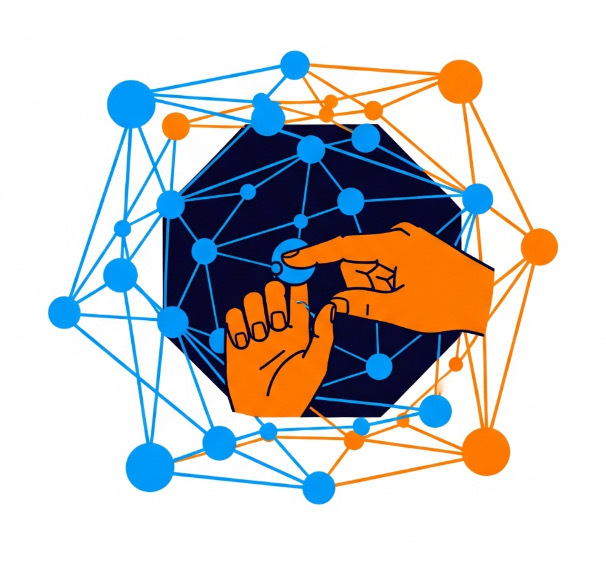

## Hello! I am [Sanchita Kamath](https://linkedin.com/in/sanchitakamath)

I am a Ph.D. Candidate affiliated with [(x)ability Design Lab](https://xabilitylab.ischool.illinois.edu/) and [(dis)Ability Design Studio](https://design-studio.illinois.edu/) at the University of Illinois at Urbana-Champaign. My work examines the intersection of Human–Computer Interaction, Cognitive Science, and Data Visualization with the goal of advancing inclusive technologies. In particular, I design, build, and evaluate systems that enable people with visual (dis)abilities to engage with complex three-dimensional data in spatially adaptive interfaces.

My research interests span accessible data visualization, multimodal and immersive analytics, virtual/augmented reality, and evidence-based accessibility. I employ mixed-methods research methodologies to connect cognitive science theory with practical system design. I am currently **seeking internship opportunities for Summer of 2026** in _user-experience research, multimodal explainable AI, and data-visualization engineering._

---

<table>
  <tr height="300px">
    <!-- Card 1: A11y Dashboard -->
    <td>
      <table>
        <tr>
          <td width="250px" height="110px" valign="top" colspan="4">
            

              <a href="https://github.com/xability/a11y_dashboard">
                 
              </a>
            

            <a href="https://github.com/xability/a11y_dashboard"><strong>A11y Dashboard</strong></a>: Interactive tools for exploring complex datasets through accessible visualizations  
              <em>Accessible Visualization</em> · <em>Inclusive HCI</em> · <em>Assistive Technology</em>
          </td>
        </tr>
        <tr>
          <!-- <td align="center"></td> -->
          <td align="center">
            
          </td>
        </tr>
      </table>
    </td>
    <!-- Card 2: PunchPulse -->
    <td>
      <table>
        <tr>
          <td width="250px" height="110px" valign="top" colspan="4">
            

              <a href="https://github.com/xability/punch-pulse">
                 
              </a>
            

            <a href="https://github.com/xability/punch-pulse"><strong>PunchPulse</strong></a>: A virtual-reality boxing exergame developed with inclusive interaction design principles  
              <em>Virtual Reality</em> · <em>Serious Games</em> · <em>Accessible Interaction</em> · <em>Physical Activity Amelioration</em>
          </td>
        </tr>
        <tr>
          <td align="center">
          
          </td>
          <td align="center">
            
          </td>
        </tr>
      </table>
    </td>
    <!-- Card 3: MAIDR -->
    <td>
      <table>
        <tr>
          <td width="250px" height="110px" valign="top" colspan="4">
            

              <a href="https://github.com/xability/maidr">
                 
              </a>
            

            <a href="https://github.com/xability/maidr"><strong>MAIDR</strong></a>: Multimodal Access and Interactive Data Representation for accessible statistical visualizations  
              <em>Accessible Visualization</em> · <em>Multimodal Interfaces</em> · <em>Data Accessibility</em>
          </td>
        </tr>
        <tr>
          <td align="center">
            
          </td>
          <td align="center">
            
          </td>
        </tr>
      </table>
    </td>
    </tr>
  <tr height="300px">
    <!-- Card 4: DIXTRAL -->
    <td>
      <table>
        <tr>
          <td width="250px" height="110px" valign="top" colspan="4">
            

              <a href="https://github.com/SK-143381/dixtral-assets2025-demo">
                 
              </a>
            

            <a href="https://github.com/SK-143381/dixtral-assets2025-demo"><strong>DIXTRAL</strong></a>: Dynamic Interface Exploration of Three-Dimensional Representations for Adaptive Learning  
              <em>3D User Interfaces</em> · <em>Adaptive Learning</em> · <em>Educational Technology</em>
          </td>
        </tr>
        <tr>
          <!-- <td align="center"></td> -->
          <td align="center">
            
          </td>
        </tr>
      </table>
    </td>
    <!-- Card 5: VR Table Tennis -->
    <td>
      <table>
        <tr>
          <td width="250px" height="110px" valign="top" colspan="4">
            

              <a href="https://github.com/xability/a11y_vr_exergame">
                 
              </a>
            

            <a href="https://github.com/xability/a11y_vr_exergame"><strong>VR Table Tennis</strong></a>: An accessible virtual-reality table-tennis experience  
              <em>Accessible VR</em> · <em>Human–Computer Interaction</em>
          </td>
        </tr>
        <tr>
          <td align="center">
            
          </td>
          <td align="center">
            
          </td>
        </tr>
      </table>
    </td>
    <!-- Card 6: Immersive Analytics VR -->
    <td>
      <table>
        <tr>
          <td width="250px" height="110px" valign="top" colspan="4">
            

              <a href="https://github.com/xability/3d_viz">
                 
              </a>
            

            <a href="https://github.com/xability/3d_viz"><strong>Immersive Analytics VR</strong></a>: Three-dimensional data visualization and natural-language interaction in virtual reality  
              <em>Immersive Analytics</em> · <em>Natural Language Interaction</em> · <em>Virtual Reality</em>
          </td>
        </tr>
        <tr>
          <!-- <td align="center"></td> -->
          <td align="center">
            
          </td>
        </tr>
      </table>
    </td>
  </tr>
</table>

---

### Research Vision and Goals

- Accessible data-visualization paradigms that include users with diverse abilities and needs
- Immersive technologies designed from the outset for universal access
- Cognitive-first interface design grounded in empirical evidence
- Producing and creating tools that bridge research theory with practice

---

### Activity in the (x)Ability Design Lab as a Ph.D. Candidate and Graduate Research Assistant

- Led the development of 3-D visualization tools for accessible data representation
- Contributed to multiple repositories addressing accessibility in VR/AR
- Co-authored several peer-reviewed publications on accessible technology design
- Ongoing work to integrate accessibility into emerging technologies

---

### GitHub Profile Summary

